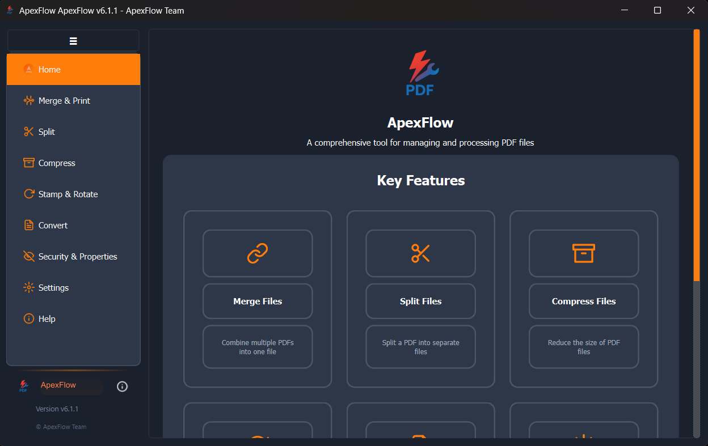

# ApexFlow 

[](https://python.org)
[](https://pypi.org/project/PySide6/)
[](docs/LICENSE.txt)
[](https://github.com/yourusername/ApexFlow)

[🇸🇦 اقرأ هذا الملف باللغة العربية](README_AR.md)

**ApexFlow** is a comprehensive, open-source desktop application for managing and processing PDF files, built with Python and PySide6. It provides an intuitive Arabic-first user interface with a powerful set of tools for all your PDF processing needs.

## ✨ Key Features

### 📄 PDF Operations
- **🔗 Merge:** Combine multiple PDF files into a single document with custom ordering
- **✂️ Split:** Extract specific pages or split PDFs into multiple files
- **🗜️ Compress:** Reduce file size while maintaining document quality
- **🔄 Rotate:** Correct page orientation (90°, 180°, 270°)
- **🔒 Security:** Add/remove password protection and encryption
- **🖼️ Stamping:** Apply custom text or image watermarks and stamps

### 🎨 User Experience
- **🌙 Modern UI:** Clean, intuitive Arabic-first interface
- **🎨 Theming:** Multiple themes (Dark, Light) with customizable accent colors
- **📱 Responsive:** Adaptive layout that works on different screen sizes
- **🚀 Performance:** Optimized processing with background workers
- **📊 Progress Tracking:** Real-time progress indicators for all operations

### 🛠️ Advanced Features
- **🖨️ Print Integration:** Direct printing with Windows printer support
- **📁 Batch Processing:** Handle multiple files simultaneously
- **💾 Smart Caching:** Intelligent preview caching for better performance
- **🔧 Settings Management:** Comprehensive settings with import/export
- **📝 Logging:** Detailed operation logs for troubleshooting

## 📸 Screenshots

### Main Interface


### PDF Merge and Print Interface


## 🚀 Quick Start

### Prerequisites

- **Python 3.8+** - [Download Python](https://python.org/downloads/)
- **Windows 10/11** - Primary supported platform
- **4GB RAM** - Minimum recommended for large PDF processing

### 📦 Installation

#### Option 1: Download Executable (Recommended)
1. Go to [Releases](https://github.com/yourusername/ApexFlow/releases)
2. Download the latest `ApexFlow-Setup.exe`
3. Run the installer and follow the setup wizard

#### Option 2: Run from Source
1. **Clone the repository:**
   ```bash
   git clone https://github.com/yourusername/ApexFlow.git
   cd ApexFlow
   ```

2. **Install dependencies:**
   ```bash
   pip install -r config/requirements.txt
   ```

3. **Run the application:**
   ```bash
   python main.py
   # or simply double-click run.bat
   ```
## 💡 Usage Examples

### Basic PDF Operations

```python
# Merge multiple PDFs
python main.py
# 1. Select "Merge & Print" from the sidebar
# 2. Click "Select Files" and choose your PDFs
# 3. Arrange files in desired order
# 4. Click "Merge Files"
```

### Advanced Features

- **Batch Processing:** Select multiple files for simultaneous operations
- **Custom Stamps:** Create and manage your own watermark library
- **Print Integration:** Direct printing to any Windows-compatible printer
- **Theme Customization:** Switch between themes and customize accent colors

## 🏗️ Project Architecture

```
ApexFlow/
├── 📄 main.py                    # Application entry point
├── 🚀 run.bat                   # Quick launch script
├── 📁 modules/                  # Core business logic
│   ├── app_utils.py            # Application utilities & managers
│   ├── merge.py                # PDF merging operations
│   ├── split.py                # PDF splitting operations
│   ├── compress.py             # PDF compression
│   ├── security.py             # Encryption & password protection
│   └── ...                     # Other processing modules
├── 📁 ui/                       # User interface components
│   ├── theme_manager.py        # Theme & styling system
│   ├── merge_page.py           # Merge interface
│   ├── notification_system.py  # Toast notifications
│   └── ...                     # Other UI components
├── 📁 assets/                   # Static resources
├── 📁 data/                     # User data & settings
├── 📁 config/                   # Configuration files
└── 📁 build_scripts/            # Build & deployment scripts
```

## 🛠️ Development

### Setting up Development Environment

1. **Fork the repository** on GitHub
2. **Clone your fork:**
   ```bash
   git clone https://github.com/yourusername/ApexFlow.git
   cd ApexFlow
   ```
3. **Create a virtual environment:**
   ```bash
   python -m venv venv
   venv\Scripts\activate  # Windows
   ```
4. **Install development dependencies:**
   ```bash
   pip install -r config/requirements.txt
   ```

### Building Executable

```bash
cd build_scripts
build.bat  # Creates executable in dist/ folder
```

### Code Style

- Follow PEP 8 guidelines
- Use Arabic comments for Arabic-specific features
- Maintain consistent naming conventions
- Add docstrings for all public methods

## 🤝 Contributing

We welcome contributions! Here's how you can help:

### 🐛 Bug Reports
- Use the [issue tracker](https://github.com/yourusername/ApexFlow/issues)
- Include system information and steps to reproduce
- Attach sample files if relevant

### 💡 Feature Requests
- Check existing issues first
- Describe the use case and expected behavior
- Consider implementation complexity

### 🔧 Pull Requests
1. Fork the repository
2. Create a feature branch (`git checkout -b feature/amazing-feature`)
3. Commit your changes (`git commit -m 'Add amazing feature'`)
4. Push to the branch (`git push origin feature/amazing-feature`)
5. Open a Pull Request

## 📊 System Requirements

| Component | Minimum | Recommended |
|-----------|---------|-------------|
| OS | Windows 10 | Windows 11 |
| Python | 3.8 | 3.11+ |
| RAM | 2GB | 4GB+ |
| Storage | 100MB | 500MB+ |
| Display | 1024x768 | 1920x1080+ |

## 🆘 Support

- 📖 **Documentation:** Check the [Wiki](https://github.com/yourusername/ApexFlow/wiki)
- 🐛 **Bug Reports:** [Issues](https://github.com/yourusername/ApexFlow/issues)
- 💬 **Discussions:** [GitHub Discussions](https://github.com/yourusername/ApexFlow/discussions)
- 📧 **Email:** support@apexflow.com

## 📄 License

This project is licensed under the **MIT License** - see the [LICENSE](docs/LICENSE.txt) file for details.

## 🙏 Acknowledgments

- **PySide6** - For the excellent Qt bindings
- **PyMuPDF** - For powerful PDF processing capabilities
- **PyInstaller** - For executable packaging
- **Contributors** - Thank you to all who have contributed to this project

---

<div align="center">
  <p>Made with ❤️ for the Arabic-speaking community</p>
  <p>⭐ Star this repository if you find it helpful!</p>
</div>
