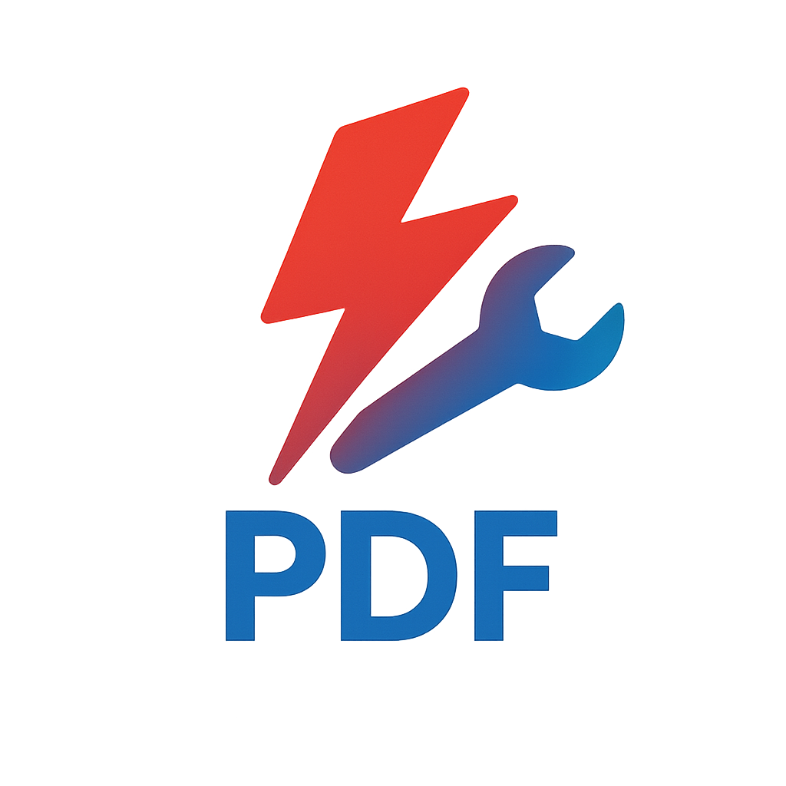

# ApexFlow 

[اقرأ هذا الملف باللغة العربية](README_AR.md)

A comprehensive, open-source desktop application for managing and processing PDF files, built with Python and PySide6. ApexFlow provides an intuitive user interface with a powerful set of tools for all your PDF needs.

## ✨ Key Features

-   **Merge:** Combine multiple PDF files into a single document.
-   **Split:** Extract pages or split a PDF into multiple smaller files.
-   **Compress:** Reduce PDF file size while maintaining quality.
-   **Rotate:** Correct the orientation of pages within a PDF.
-   **Security:** Protect your documents with password encryption.
-   **Stamping:** Apply text or image stamps to your PDF pages.
-   **Theming:** A customizable UI with multiple themes (dark, light, etc.) and accent colors.

## 🚀 Getting Started

### Prerequisites

-   Python 3.8 or higher
-   pip (Python package installer)

### Installation

1.  **Clone the repository:**
    ```bash
    git clone https://github.com/aljawalcar-glitch/ApexFlow.git
    cd ApexFlow
    ```

2.  **Create a virtual environment (recommended):**
    ```bash
    python -m venv venv
    source venv/bin/activate  # On Windows, use `venv\Scripts\activate`
    ```

3.  **Install dependencies:**
    Install all required packages from the `requirements.txt` file.
    ```bash
    pip install -r requirements.txt
    ```

## 🏃‍♀️ Usage

To run the application, simply execute the `run_app.bat` script from the project's root directory.

```bash
./run_app.bat
```

This will launch the ApexFlow main window.

## 📂 Project Structure

The project is organized into the following directories:

-   `assets/`: Contains all static assets like icons, logos, and images.
-   `data/`: Stores application data, such as settings and stamps.
-   `modules/`: The backend logic for all PDF processing features (merge, split, etc.) and application settings.
-   `ui/`: Contains all the user interface components, widgets, pages, and styling built with PySide6.
-   `main.py`: The main entry point of the application.
-   `requirements.txt`: A list of all Python dependencies for the project.

## 🤝 Contributing

Contributions are welcome! If you have suggestions for improvements or want to report a bug, please feel free to open an issue or submit a pull request.

## 📄 License

This project is licensed under the MIT License. See the `docs/LICENSE.txt` file for details.
