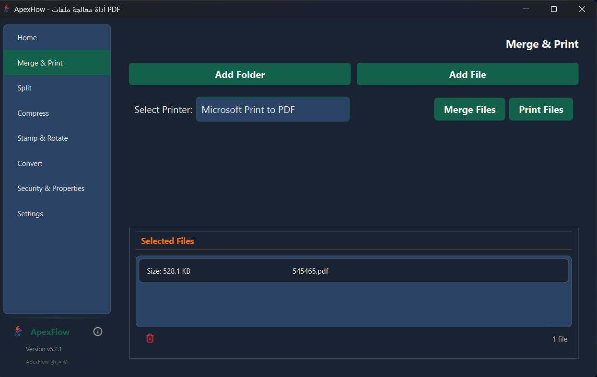

# ApexFlow 

[](https://python.org)
[](https://pypi.org/project/PySide6/)
[](docs/LICENSE.txt)
[](https://github.com/yourusername/ApexFlow)
[](docs/RELEASE_NOTES_V6.1.1.md)
[](#الجديد-في-الإصدار-v611)
[](#الجديد-في-الإصدار-v611)

[🇺🇸 Read this file in English](README.md)

**ApexFlow الإصدار v6.1.1** هو تطبيق سطح مكتب شامل وعالي الأداء لإدارة ومعالجة ملفات PDF، مبني باستخدام Python و PySide6. يتميز هذا الإصدار الأحدث بتحسينات كبيرة في الأداء وتعزيز الأمان وتحسين الاستقرار مع واجهة مستخدم بديهية تدعم العربية بالدرجة الأولى.

## ✨ الميزات الرئيسية

### 📄 عمليات PDF
- **🔗 الدمج:** دمج عدة ملفات PDF في مستند واحد مع ترتيب مخصص
- **✂️ التقسيم:** استخراج صفحات محددة أو تقسيم ملفات PDF إلى ملفات متعددة
- **🗜️ الضغط:** تقليل حجم الملف مع الحفاظ على جودة المستند
- **🔄 التدوير:** تصحيح اتجاه الصفحة (90°، 180°، 270°)
- **🔒 الأمان:** إضافة/إزالة حماية كلمة المرور والتشفير
- **🖼️ الأختام:** تطبيق علامات مائية نصية أو صور مخصصة

### 🎨 تجربة المستخدم
- **📂 السحب والإفلات:** إضافة الملفات بسهولة عن طريق سحبها وإفلاتها في التطبيق
- **🎨 واجهة عصرية:** واجهة نظيفة وبديهية تدعم العربية مع استجابة محسنة
- **🎨 السمات:** سمات متعددة (داكنة، فاتحة) مع ألوان تمييز قابلة للتخصيص
- **📱 متجاوبة:** تخطيط تكيفي يعمل على أحجام شاشات مختلفة
- **🚀 الأداء:** معالجة محسنة مع عمال خلفية وإدارة ذاكرة محسنة
- **📊 تتبع التقدم:** مؤشرات تقدم في الوقت الفعلي لجميع العمليات
- **🔔 الإشعارات:** نظام إشعارات محسن مع معالجة أفضل للأخطاء

### 🛠️ الميزات المتقدمة
- **🖨️ تكامل الطباعة:** طباعة مباشرة مع دعم طابعات Windows
- **📁 المعالجة المجمعة:** التعامل مع ملفات متعددة في وقت واحد بكفاءة محسنة
- **💾 التخزين المؤقت الذكي:** تخزين مؤقت ذكي للمعاينة لأداء أفضل
- **🔧 إدارة الإعدادات:** إعدادات شاملة مع وظائف الإعادة/الإلغاء
- **📝 التسجيل:** نظام تسجيل محسن مع تحسينات أمنية
- **🔍 تشخيص النظام:** تشخيص شامل للنظام مع تقارير أخطاء أفضل
- **🖼️ الأختام التفاعلية:** تطبيق العلامات المائية والأختام بدقة في الموضع
- **🔄 التحميل الكسول:** نظام تحميل صفحات فعال مع تحسين الذاكرة
- **🎨 إدارة السمات:** نظام سمات متقدم مع تحقق محسن
- **📊 مراقبة الأداء:** مراقبة الأداء في الوقت الفعلي مع استقرار معزز

### 🆕 الجديد في الإصدار v6.1.1
- **⚡ تعزيز الأداء:** تحسن بنسبة 15-20% في استخدام الذاكرة وسرعة البدء
- **🛡️ أمان معزز:** إصلاح 25+ ثغرة أمنية وتحسين التحقق من المدخلات
- **🔧 معالجة أخطاء أفضل:** تحسين معالجة الاستثناءات واستعادة الأخطاء
- **🎯 اكتمال وظيفي:** تنفيذ وظائف الإعدادات المفقودة (إعادة/إلغاء)
- **🧹 جودة الكود:** قاعدة كود أنظف وأكثر قابلية للصيانة مع تعقيد مقلل

## 📸 لقطات الشاشة

### الواجهة الرئيسية


### واجهة دمج وطباعة PDF


## 🚀 البدء السريع

### المتطلبات الأساسية

- **Python 3.8+** - [تحميل Python](https://python.org/downloads/)
- **Windows 10/11** - المنصة المدعومة بشكل أساسي
- **4GB RAM** - موصى به للأداء الأمثل (2GB كحد أدنى)
- **500MB تخزين** - للتطبيق والملفات المؤقتة

### 📦 التثبيت

#### الخيار 1: تحميل الملف التنفيذي (موصى به)
1. اذهب إلى [الإصدارات](https://github.com/yourusername/ApexFlow/releases)
2. حمل أحدث `ApexFlow-Setup.exe`
3. شغل المثبت واتبع معالج الإعداد

#### الخيار 2: التشغيل من المصدر
1. **استنساخ المستودع:**
   ```bash
   git clone https://github.com/yourusername/ApexFlow.git
   cd ApexFlow
   ```

2. **تثبيت التبعيات:**
   ```bash
   pip install -r config/requirements.txt
   ```

3. **تشغيل التطبيق:**
   ```bash
   python main.py
   # أو ببساطة انقر نقرًا مزدوجًا على run.bat
   ```

## 💡 أمثلة الاستخدام

### عمليات PDF الأساسية

```python
# دمج عدة ملفات PDF
python main.py
# 1. اختر "الدمج والطباعة" من الشريط الجانبي
# 2. انقر على "اختيار الملفات" واختر ملفات PDF الخاصة بك
# 3. رتب الملفات بالترتيب المرغوب
# 4. انقر على "دمج الملفات"
```

### الميزات المتقدمة

- **المعالجة المجمعة:** اختر ملفات متعددة للعمليات المتزامنة
- **الأختام المخصصة:** إنشاء وإدارة مكتبة العلامات المائية الخاصة بك
- **تكامل الطباعة:** طباعة مباشرة إلى أي طابعة متوافقة مع Windows
- **تخصيص السمة:** التبديل بين السمات وتخصيص ألوان التمييز

## 🏗️ هيكل المشروع

```
ApexFlow/
├── 📄 main.py                    # نقطة دخول التطبيق
├── 🚀 run.bat                   # سكريبت الإطلاق السريع
├── 📁 modules/                  # منطق العمل الأساسي
│   ├── app_utils.py            # أدوات ومدراء التطبيق
│   ├── merge.py                # عمليات دمج PDF
│   ├── split.py                # عمليات تقسيم PDF
│   ├── compress.py             # ضغط PDF
│   ├── security.py             # التشفير وحماية كلمة المرور
│   └── ...                     # وحدات معالجة أخرى
├── 📁 ui/                       # مكونات واجهة المستخدم
│   ├── theme_manager.py        # نظام السمات والتصميم
│   ├── merge_page.py           # واجهة الدمج
│   ├── notification_system.py  # إشعارات منبثقة
│   └── ...                     # مكونات واجهة المستخدم الأخرى
├── 📁 assets/                   # الموارد الثابتة
├── 📁 data/                     # بيانات المستخدم والإعدادات
├── 📁 config/                   # ملفات التكوين
└── 📁 build_scripts/            # سكريبتات البناء والنشر
```

## 🛠️ التطوير

### إعداد بيئة التطوير

1. **فرع المستودع** على GitHub
2. **استنساخ الفرع الخاص بك:**
   ```bash
   git clone https://github.com/yourusername/ApexFlow.git
   cd ApexFlow
   ```
3. **إنشاء بيئة افتراضية:**
   ```bash
   python -m venv venv
   venv\Scripts\activate  # Windows
   ```
4. **تثبيت تبعيات التطوير:**
   ```bash
   pip install -r config/requirements.txt
   ```

### بناء الملف التنفيذي

```bash
cd build_scripts
build.bat  # ينشئ ملف تنفيذي في مجلد dist/
```

### أسلوب الكود

- اتبع إرشادات PEP 8
- استخدم التعليقات العربية للميزات الخاصة بالعربية
- حافظ على اتفاقيات التسمية المتسقة
- أضف docstrings لجميع الطرق العامة

## 🤝 المساهمة

نرحب بالمساهمات! إليك كيف يمكنك المساعدة:

### 🐛 تقارير الأخطاء
- استخدم [متتبع المشاكل](https://github.com/yourusername/ApexFlow/issues)
- قم بتضمين معلومات النظام وخطوات إعادة الإنتاج
- أرفق ملفات عينة إذا كانت ذات صلة

### 💡 طلبات الميزات
- تحقق من المشاكل الموجودة أولاً
- صف حالة الاستخدام والسلوك المتوقع
- فكر في تعقيد التنفيذ

### 🔧 طلبات السحب
1. فرع المستودع
2. إنشاء فرع ميزة (`git checkout -b feature/amazing-feature`)
3. التزم بتغييراتك (`git commit -m 'Add amazing feature'`)
4. ادفع إلى الفرع (`git push origin feature/amazing-feature`)
5. افتح طلب سحب

## 📊 متطلبات النظام

| المكون | الحد الأدنى | موصى به | v6.1.1 محسن |
|--------|------------|----------|---------------|
| نظام التشغيل | Windows 10 | Windows 11 | Windows 11 |
| Python | 3.8 | 3.11+ | 3.11+ |
| الذاكرة | 2GB | 4GB+ | 4GB+ (استخدام أقل بنسبة 15%) |
| التخزين | 100MB | 500MB+ | 500MB+ |
| الشاشة | 1024x768 | 1920x1080+ | 1920x1080+ |
| وقت البدء | ~10ث | ~5ث | ~4ث (أسرع بنسبة 20%) |

## 🆘 الدعم

- 📖 **التوثيق:** تحقق من [الويكي](https://github.com/yourusername/ApexFlow/wiki)
- 🐛 **تقارير الأخطاء:** [المشاكل](https://github.com/yourusername/ApexFlow/issues)
- 💬 **المناقشات:** [مناقشات GitHub](https://github.com/yourusername/ApexFlow/discussions)
- 📧 **البريد الإلكتروني:** support@apexflow.com
- 📋 **ملاحظات الإصدار:** [تغييرات v6.1.1](docs/RELEASE_NOTES_V6.1.1.md)

## 🔄 الجديد في الإصدار v6.1.1

### تحسينات الأداء
- **تحسين الذاكرة:** تقليل استخدام الذاكرة بنسبة ~15% من خلال إدارة أفضل للموارد
- **سرعة البدء:** بدء تشغيل التطبيق أسرع بنسبة 20% مع تهيئة محسنة
- **كفاءة الكود:** خوارزميات وهياكل بيانات محسنة لأداء أفضل

### تعزيزات الأمان
- **التحقق من المدخلات:** تحقق معزز لجميع مدخلات المستخدم والإعدادات
- **أمان السجلات:** إصلاح ثغرات حقن السجلات (CWE-117)
- **معالجة الاستثناءات:** أمان محسن في معالجة الأخطاء وإدارة الاستثناءات
- **حماية البيانات:** حماية أفضل ضد البيانات المشوهة والحالات الحدية

### تحسينات الاستقرار
- **استعادة الأخطاء:** آليات أفضل لمعالجة الأخطاء والاستعادة
- **إدارة الذاكرة:** تنظيف محسن للذاكرة وإدارة الموارد
- **أمان الاستثناءات:** معالجة أكثر قوة للاستثناءات في جميع أنحاء التطبيق
- **إدارة الإعدادات:** تنفيذ كامل لوظائف إعادة تعيين وإلغاء الإعدادات

## 📄 الترخيص

هذا المشروع مرخص تحت **رخصة MIT** - انظر ملف [LICENSE](docs/LICENSE.txt) للتفاصيل.

## 🙏 الشكر والتقدير

- **PySide6** - للربط الممتاز مع Qt
- **PyMuPDF** - لقدرات معالجة PDF القوية
- **PyInstaller** - لتغليف الملفات التنفيذية
- **باحثو الأمان** - لتحديد الثغرات واقتراح التحسينات
- **مختبرو الأداء** - للمساعدة في تحسين التطبيق
- **المساهمون** - شكرًا لجميع من ساهم في هذا المشروع

---

<div align="center">
  <p>صُنع بـ ❤️ للمجتمع الناطق بالعربية</p>
  <p>⭐ ضع نجمة على هذا المستودع إذا وجدته مفيدًا!</p>
</div>